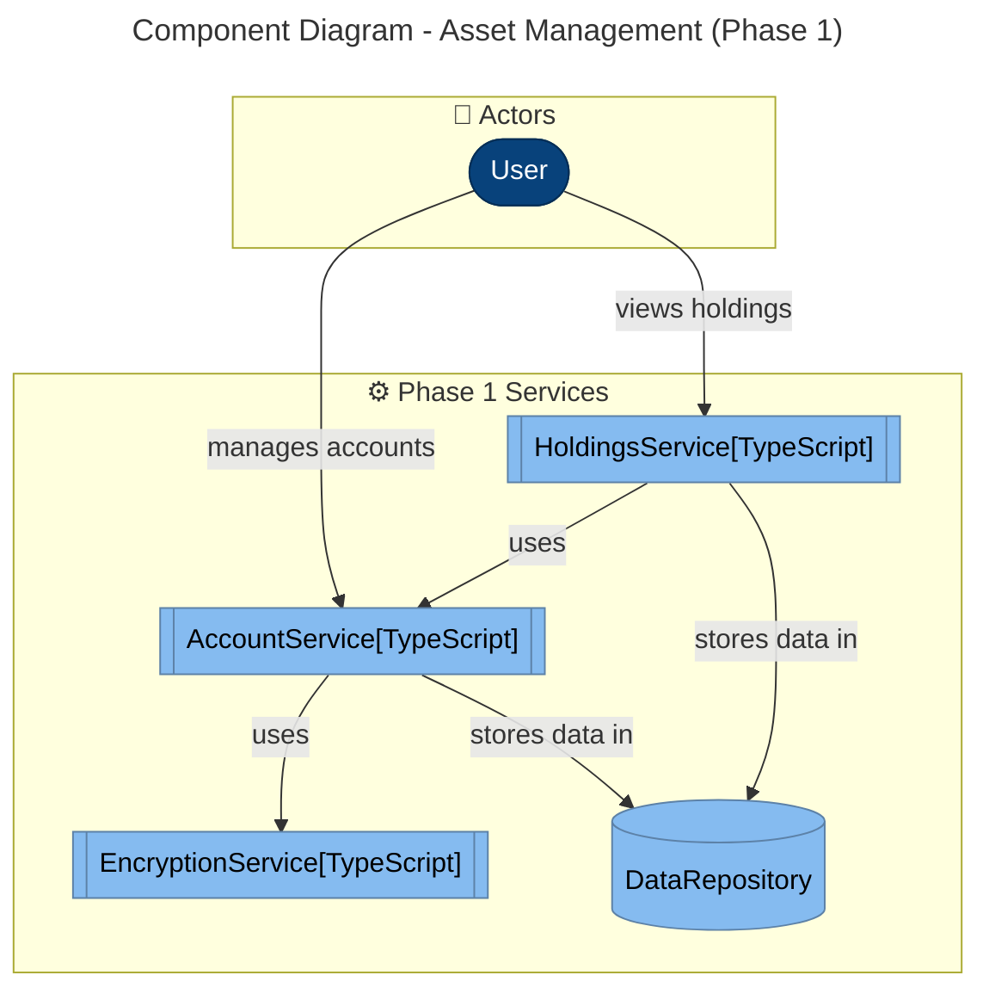

# DESIGN-資産管理WEBアプリ-001: C4 Model

> Generated by MUSUBIX v3.8.2  
> Date: 2026-02-11  
> Source: REQ-資産管理WEBアプリ-001.md

## Implementation Phases

### Phase 1 (Initial - Article VII準拠)
初期実装は以下の3サービスに限定:
- **AccountService**: 証券口座管理
- **HoldingsService**: 保有証券データ取得・集約
- **EncryptionService**: 認証情報の暗号化

### Phase 2 (Extended)
- TrackingService (履歴・グラフ)
- ExportService (CSV出力)
- ValidationService (データ検証)
- JobScheduler (自動同期)

### Phase 3 (Advanced)
- AuditService (監査ログ)
- EventBus (ドメインイベント)

## C4 Component Diagram (Phase 1)



## Component Details

> **実装優先度**: Phase 1サービスから順次実装（Article VII: Simplicity Gate準拠）

### Phase 1 Services (Initial Implementation)

#### AccountService
- **責務**: 証券会社アカウント情報の管理（楽天証券、SBI証券）
- **関連要件**: REQ-009, REQ-010 (アカウントCRUD), REQ-008 (認証情報の暗号化保存)
- **依存**: EncryptionService, DataRepository
- **公開API**: 
  - `addAccount(credentials: AccountCredentials): Result<Account, Error>`
  - `updateAccount(id: string, credentials: AccountCredentials): Result<void, Error>`
  - `deleteAccount(id: string): Result<void, Error>`
  - `listAccounts(): Result<Account[], Error>`

#### HoldingsService
- **フェーズ**: Phase 1 (初期実装)
- **責務**: 保有証券データの取得・集約・計算
- **関連要件**: REQ-001, REQ-002, REQ-017, REQ-018, REQ-019 (加重平均)
- **依存**: AccountService, IWriteRepository<Holding>, BrokerageAdapterFactory
- **Phase 2移行**: ValidationService, EventBus (Phase 2で追加)
- **公開API**:
  - `fetchHoldings(accountId: string): Result<Holding[], Error>`
  - `aggregateHoldings(): Result<AggregatedHolding[], Error>`
  - `calculateAveragePurchasePrice(holdings: Holding[]): Result<Price, Error>`
- **パターン**: Strategy Pattern (BrokerageAdapterFactory経由)

#### DataRepository  
- **責務**: 全データの永続化とCRUD操作
- **関連要件**: REQ-002, REQ-013 (履歴保存), REQ-035 (バックアップ)
- **パターン**: Repository Pattern
- **実装**: IWriteRepository<T> インターフェースを実装
- **公開API**:
  - `save<T>(entity: T): Result<T, Error>`
  - `findById<T>(id: string): Result<T | null, Error>`
  - `query<T>(criteria: QueryCriteria): Result<T[], Error>`
  - `delete(id: string): Result<void, Error>`

#### EncryptionService
- **フェーズ**: Phase 1 (初期実装)
- **責務**: 暗号化/復号化処理、暗号化キー管理
- **関連要件**: REQ-008, REQ-031 (ハードコード禁止), REQ-032 (マスターキー生成)
- **依存**: なし（インフラ層）
- **公開API**:
  - `encrypt(plainText: string): Result<string, Error>`
  - `decrypt(cipherText: string): Result<string, Error>`
  - `generateMasterKey(): Result<string, Error>`

### Phase 2 Services (Extended)

#### ValidationService
- **フェーズ**: Phase 2
- **責務**: データ検証・整合性チェック
- **関連要件**: REQ-011 (失敗時エラー表示), REQ-034 (詳細エラー表示)
- **依存**: なし
- **公開API**:
  - `validateHolding(holding: Holding): Result<void, ValidationError>`
  - `validateAccount(account: Account): Result<void, ValidationError>`

### UI/Presentation Services (Phase 2)

#### TrackingService
- **フェーズ**: Phase 2
- **責務**: 資産推移の追跡・グラフ表示
- **関連要件**: REQ-013, REQ-014 (トレンドグラフ), REQ-027 (配当グラフ), REQ-036 (チャートライブラリ)
- **依存**: HoldingsService, EventBus (Domain Events Pattern)
- **公開API**:
  - `recordSnapshot(): Result<Snapshot, Error>`
  - `getTrendData(period: TimePeriod): Result<TrendData[], Error>`
  - `getDividendHistory(): Result<DividendData[], Error>`

#### ExportService
- **フェーズ**: Phase 2
- **責務**: データエクスポート機能
- **関連要件**: REQ-029 (CSV出力), REQ-030 (月次レポート)
- **依存**: IReadRepository<Holding>, IReadRepository<Snapshot> (ISP準拠)
- **公開API**:
  - `exportToCSV(data: Holding[]): Result<string, Error>`
  - `generateMonthlyReport(month: YearMonth): Result<Report, Error>`

### Phase 2 Infrastructure Services

#### JobScheduler (Infrastructure)
- **責務**: スケジューリング基盤（cron的機能）
- **関連要件**: REQ-006 (自動同期), REQ-033 (為替レート取得)
- **依存**: なし（Infrastructure層）
- **公開API**:
  - `schedule(job: Job, interval: Duration): Result<JobId, Error>`
  - `cancel(jobId: JobId): Result<void, Error>`
  - `listJobs(): Result<Job[], Error>`

#### AutoSyncUseCase (Application)
- **責務**: 自動同期ロジック（ビジネスルール）
- **関連要件**: REQ-006
- **依存**: HoldingsService, JobScheduler
- **公開API**:
  - `setupAutoSync(config: SyncConfig): Result<void, Error>`
  - `disableAutoSync(): Result<void, Error>`

#### ValidationService
- **責務**: データ検証・整合性チェック
- **関連要件**: REQ-011 (失敗時エラー表示), REQ-034 (詳細エラー表示)
- **依存**: なし
- **公開API**:
  - `validateHolding(holding: Holding): Result<void, ValidationError>`
  - `validateAccount(account: Account): Result<void, ValidationError>`

#### AuditService
- **責務**: 操作ログ記録
- **関連要件**: REQ-038 (ログ30日保持)
- **依存**: DataRepository
- **公開API**:
  - `logOperation(operation: Operation): Result<void, Error>`
  - `getLogs(period: TimePeriod): Result<LogEntry[], Error>`

## CLI Interface (Article II準拠)

### Phase 1 Commands

```bash
# Account Management
asset-cli account add --brokerage <rakuten|sbi> --username <user> --password <pass>
asset-cli account list
asset-cli account update <id> --password <new-pass>
asset-cli account delete <id>

# Holdings Management
asset-cli holdings fetch <account-id>      # 指定口座の保有証券取得
asset-cli holdings fetch --all             # 全口座の保有証券取得
asset-cli holdings aggregate               # 複数口座の集約
asset-cli holdings list [--account <id>]   # 保有証券一覧表示

# Encryption Key Management
asset-cli encrypt generate-key              # マスターキー生成
asset-cli encrypt rotate-key                # キーローテーション
```

### Phase 2 Commands

```bash
# Export
asset-cli export csv [--output <file>]
asset-cli export report --month <YYYY-MM>

# Tracking
asset-cli track snapshot                    # 手動スナップショット作成
asset-cli track graph --period <30d|90d|1y> # グラフデータ取得

# Scheduling
asset-cli schedule auto-sync --interval <hours>
asset-cli schedule list
```

### Phase 3 Commands

```bash
# Audit
asset-cli audit logs --since <date> --until <date>
asset-cli audit stats
```

## Design Patterns Applied

### 1. Repository Pattern
- **適用先**: DataRepository
- **理由**: データアクセス層の抽象化、永続化メカニズムの隠蔽

### 2. Domain Events Pattern  
- **適用先**: EventBus ← HoldingsService / TrackingService → EventBus
- **理由**: データ更新時のUI自動反映、レイヤー間の疎結合化
- **実装**: EventBus経由でHoldingsServiceがイベント発行、TrackingServiceが購読
- **イベント**: `HoldingsFetchedEvent`, `HoldingsAggregatedEvent`, `SnapshotCreatedEvent`

### 3. Strategy Pattern + Factory Pattern
- **適用先**: HoldingsService (証券会社別の取得戦略)
- **理由**: 楽天証券・SBI証券それぞれの取得方法を切り替え可能に
- **実装**: `IBrokerageAdapter` インターフェース + 具体実装 + `BrokerageAdapterFactory`
- **Factory実装**:
  ```typescript
  class BrokerageAdapterFactory {
    private adapters = new Map<Brokerage, IBrokerageAdapter>();
    
    register(brokerage: Brokerage, adapter: IBrokerageAdapter): void;
    create(brokerage: Brokerage): Result<IBrokerageAdapter, Error>;
  }
  ```

### 4. Dependency Injection
- **適用先**: すべてのサービス
- **理由**: テスタビリティ向上、Singleton問題の回避
- **実装**: コンストラクタインジェクション

## Architecture Layers

本設計は4層のレイヤードアーキテクチャを採用します（DIP準拠）:

```
┌─────────────────────────────────────────┐
│  Presentation Layer                     │
│  - UI Components                        │
│  - TrackingService (グラフ表示)         │
│  - ExportService (CSV出力)              │
└─────────────────────────────────────────┘
              ↓ depends on
┌─────────────────────────────────────────┐
│  Application Layer                      │
│  - HoldingsService (ユースケース)        │
│  - AccountService (ユースケース)         │
│  - AutoSyncUseCase (自動化ロジック)    │
└─────────────────────────────────────────┘
              ↓ depends on
┌─────────────────────────────────────────┐
│  Domain Layer                           │
│  - Account (エンティティ)                │
│  - Holding (エンティティ)                │
│  - Price (Value Object)                 │
│  - ValidationService (ドメインロジック)  │
└─────────────────────────────────────────┘
              ↓ depends on
┌─────────────────────────────────────────┐
│  Infrastructure Layer                   │
│  - DataRepository (永続化)              │
│  - EncryptionService (暗号化)           │
│  - BrokerageAdapter (外部API)           │
│  - AuditService (ログ)                  │
│  - JobScheduler (スケジューラ)            │
│  - EventBus (イベントバス)               │
└─────────────────────────────────────────┘
```

**依存関係ルール**:
- 上位層は下位層に依存可能
- 下位層は上位層に依存禁止
- Domain層はインターフェースのみ定義、Infrastructure層が実装

## Domain Model

### Entities

#### Account (証券口座エンティティ)
```typescript
interface Account {
  readonly id: AccountId;           // Value Object
  readonly brokerage: Brokerage;    // 'rakuten' | 'sbi'
  credentials: EncryptedCredentials; // 暗号化された認証情報
  readonly createdAt: DateTime;
  lastSyncedAt: DateTime | null;
}
```
- **不変条件**: credentials は常に暗号化済みであること (REQ-008)
- **ライフサイクル**: 作成 → 同期 → 更新 → 削除
- **関連**: REQ-009, REQ-010

#### Holding (保有証券エンティティ)
```typescript
interface Holding {
  readonly id: HoldingId;
  readonly accountId: AccountId;
  readonly security: Security;      // 証券情報
  quantity: Quantity;                // 保有数量
  averagePurchasePrice: Price;      // 平均購入価格
  currentPrice: Price;               // 現在価格
  readonly recordedAt: DateTime;
}
```
- **不変条件**: quantity > 0、価格は正の数値
- **計算プロパティ**: 
  - `totalCost = quantity * averagePurchasePrice`
  - `currentValue = quantity * currentPrice`
  - `gainLoss = currentValue - totalCost`
- **関連**: REQ-002, REQ-018, REQ-019

#### Snapshot (履歴スナップショットエンティティ)
```typescript
interface Snapshot {
  readonly id: SnapshotId;
  readonly timestamp: DateTime;
  holdings: Holding[];
  totalValue: Money;                 // 総資産額
  readonly metadata: SnapshotMetadata;
}
```
- **不変条件**: 作成後は変更不可（イミュータブル）
- **関連**: REQ-013, REQ-014

### Value Objects

#### Price (価格 Value Object)
```typescript
interface Price {
  readonly amount: number;
  readonly currency: Currency;       // 'JPY' | 'USD'
  
  // メソッド
  equals(other: Price): boolean;
  multiply(factor: number): Price;
  add(other: Price): Price;          // 同通貨のみ
}
```
- **不変性**: 作成後変更不可
- **検証**: amount >= 0、currency は有効な通貨コード
- **関連**: REQ-022, REQ-023

#### Security (証券情報 Value Object)
```typescript
interface Security {
  readonly ticker: string;           // 銘柄コード
  readonly name: string;             // 銘柄名
  readonly type: SecurityType;       // 'stock' | 'mutualFund'
  readonly currency: Currency;
  
  equals(other: Security): boolean;
}
```
- **関連**: REQ-024, REQ-025

#### Quantity (数量 Value Object)
```typescript
interface Quantity {
  readonly value: number;
  readonly unit: 'shares' | 'units'; // 株 or 口数
  
  add(other: Quantity): Quantity;
  equals(other: Quantity): boolean;
}
```
- **検証**: value > 0
- **関連**: REQ-025 (投資信託の口数対応)

#### AccountId, HoldingId, SnapshotId (識別子 Value Objects)
```typescript
type AccountId = Brand<string, 'AccountId'>;
type HoldingId = Brand<string, 'HoldingId'>;
type SnapshotId = Brand<string, 'SnapshotId'>;

// Branded Type による型安全性確保
```

### Aggregates

#### HoldingsAggregate
- **ルート**: Holding[]
- **責務**: 複数口座にまたがる同一証券の集約（REQ-018）
- **操作**:
  - `aggregateBySecurity(): Map<Security, AggregatedHolding>`
  - `calculateWeightedAveragePrice(holdings: Holding[]): Price` (REQ-019)

### Domain Services

#### WeightedAveragePriceCalculator
```typescript
interface WeightedAveragePriceCalculator {
  calculate(holdings: Holding[]): Result<Price, CalculationError>;
}
```
- **理由**: 加重平均計算はエンティティの責務ではなく、複数エンティティにまたがるドメインロジック
- **関連**: REQ-019

## Interface Definitions (ISP準拠)

### Repository Interfaces

#### IReadRepository<T> (ISP: 読み取り専用)
```typescript
interface IReadRepository<T extends Entity> {
  findById(id: string): Result<T | null, RepositoryError>;
  query(criteria: QueryCriteria<T>): Result<T[], RepositoryError>;
}
```

#### IWriteRepository<T> (ISP: 読み書き)
```typescript
interface IWriteRepository<T extends Entity> extends IReadRepository<T> {
  save(entity: T): Result<T, RepositoryError>;
  delete(id: string): Result<void, RepositoryError>;
}
```

**使用例**:
- `ExportService`: `IReadRepository<Holding>` のみ依存（書き込み不要）
- `HoldingsService`: `IWriteRepository<Holding>` に依存

#### ISnapshotRepository (ISP: 読み取り専用インターフェース分離)
```typescript
interface ISnapshotRepository {
  saveSnapshot(snapshot: Snapshot): Result<Snapshot, RepositoryError>;
  findSnapshotsByPeriod(period: TimePeriod): Result<Snapshot[], RepositoryError>;
}
```

### Service Interfaces

#### IBrokerageAdapter (Strategy Pattern)
```typescript
interface IBrokerageAdapter {
  readonly brokerage: Brokerage;
  
  fetchHoldings(credentials: Credentials): Promise<Result<RawHolding[], FetchError>>;
  validateCredentials(credentials: Credentials): Result<void, ValidationError>;
}

// 実装例: RakutenBrokerageAdapter, SBIBrokerageAdapter
```

#### IEncryptionService
```typescript
interface IEncryptionService {
  encrypt(plainText: string, dek: CryptoKey): Result<string, EncryptionError>;
  decrypt(cipherText: string, dek: CryptoKey): Result<string, EncryptionError>;
  deriveMasterKey(passphrase: string, salt: Uint8Array): Result<CryptoKey, EncryptionError>;
  rotateMasterKey(oldPass: string, newPass: string): Result<void, EncryptionError>;
}
```

#### IEventBus (Domain Events管理)
```typescript
interface DomainEvent {
  readonly eventId: string;
  readonly occurredAt: DateTime;
  readonly eventType: string;
}

type EventHandler<T extends DomainEvent> = (event: T) => void | Promise<void>;

interface Subscription {
  readonly eventType: string;
  readonly handler: Function;
}

interface IEventBus {
  publish<T extends DomainEvent>(event: T): void;
  subscribe<T extends DomainEvent>(
    eventType: string,
    handler: EventHandler<T>
  ): Subscription;
  unsubscribe(subscription: Subscription): void;
}
```

#### IValidationService
```typescript
interface IValidationService {
  validate<T>(entity: T, schema: ValidationSchema): Result<void, ValidationError[]>;
}
```

#### IAuditLogger (ISP: ログ記録のみ)
```typescript
interface IAuditLogger {
  log(event: AuditEvent): Result<void, LogError>;
}

interface IAuditReader {
  getLogs(filter: LogFilter): Result<AuditEvent[], LogError>;
}
```

### Use Case Interfaces

#### IFetchHoldingsUseCase
```typescript
interface IFetchHoldingsUseCase {
  execute(accountId: AccountId): Promise<Result<Holding[], UseCaseError>>;
}
```

#### IAggregateHoldingsUseCase
```typescript
interface IAggregateHoldingsUseCase {
  execute(): Promise<Result<AggregatedHolding[], UseCaseError>>;
}
```

#### IExportDataUseCase
```typescript
interface IExportDataUseCase {
  executeCSV(holdings: Holding[]): Result<string, ExportError>;
  executeMonthlyReport(month: YearMonth): Result<Report, ExportError>;
}
```

### SOLID Principles Compliance

#### Single Responsibility Principle (SRP)
- 各サービスは単一の責務を持つ
- 例: `EncryptionService` は暗号化のみ、`ValidationService` は検証のみ

#### Open/Closed Principle (OCP)
- `IBrokerageAdapter` により新しい証券会社追加が容易
- 既存コード変更なしに拡張可能

#### Liskov Substitution Principle (LSP)
- すべての実装はインターフェースの契約を遵守
- 例: `RakutenBrokerageAdapter` と `SBIBrokerageAdapter` は相互に置換可能

#### Interface Segregation Principle (ISP)
- `IAuditLogger` と `IAuditReader` を分離
- `ISnapshotRepository` を `IDataRepository` から分離
- クライアントは必要なメソッドのみに依存

#### Dependency Inversion Principle (DIP)
- 高レベルモジュールは抽象（インターフェース）に依存
- `HoldingsService` は `IDataRepository` に依存（具体実装には非依存）
- レイヤー間の依存は常にインターフェース経由

## Traceability

### コンポーネント → 要件マッピング

| Component | Requirements | Layer |
|-----------|-------------|-------|
| AccountService | REQ-008, REQ-009, REQ-010 | Application |
| HoldingsService | REQ-001, REQ-002, REQ-009, REQ-017, REQ-018, REQ-019, REQ-022 | Application |
| AutoSyncUseCase | REQ-006 | Application |
| EncryptionService | REQ-008, REQ-031, REQ-032, REQ-037 | Infrastructure |
| TrackingService | REQ-013, REQ-014, REQ-027, REQ-036 | Presentation |
| ExportService | REQ-029, REQ-030 | Presentation |
| ValidationService | REQ-011, REQ-034 | Domain |
| JobScheduler | REQ-006, REQ-033 | Infrastructure |
| AuditService | REQ-038 | Infrastructure |
| DataRepository | REQ-002, REQ-013, REQ-035 | Infrastructure |
| EventBus | REQ-013, REQ-014 | Infrastructure |

### 要件 → コンポーネント 逆引き

| Requirement | Components |
|-------------|------------|
| REQ-001 (Web統合UI) | HoldingsService, TrackingService |
| REQ-002 (データ取得・保存) | HoldingsService, DataRepository |
| REQ-006 (自動同期) | ScheduleService |
| REQ-008 (暗号化保存) | AccountService, EncryptionService |
| REQ-013 (履歴保存) | TrackingService, DataRepository |
| REQ-014 (トレンドグラフ) | TrackingService |
| REQ-017 (CSV/スクレイピング) | HoldingsService (BrokerageAdapter) |
| REQ-018 (集約) | HoldingsService (HoldingsAggregate) |
| REQ-019 (加重平均) | WeightedAveragePriceCalculator |
| REQ-029 (CSV出力) | ExportService |
| REQ-031 (ハードコード禁止) | EncryptionService |
| REQ-038 (ログ) | AuditService |

### 依存関係マトリックス

```
                    Account  Holdings  Tracking  Export  Schedule  Valid  Encrypt  Audit  DataRepo
AccountService         -        ✓         -        -        -        -       ✓       -       ✓
HoldingsService        ✓        -         -        -        -        ✓       -       -       ✓
TrackingService        -        ✓         -        -        -        -       -       -       ✓
ExportService          -        ✓         ✓        -        -        -       -       -       -
ScheduleService        -        ✓         -        -        -        -       -       -       -
ValidationService      -        -         -        -        -        -       -       -       -
EncryptionService      -        -         -        -        -        -       -       -       -
AuditService           -        -         -        -        -        -       -       -       ✓
DataRepository         -        -         -        -        -        -       -       -       -
```

**✓** = 依存あり (左側が右側に依存)

**循環依存チェック**: なし (DAG検証済み)

## Test Strategy (Article III, IX準拠)

### Unit Tests
各コンポーネントの単体テスト（Vitest + テスト駆動開発）:

#### AccountService Tests
```typescript
describe('AccountService', () => {
  it('should add account with encrypted credentials', async () => {
    // Given: valid credentials
    // When: addAccount called
    // Then: account saved with encrypted password
  });
  
  it('should return error when brokerage is invalid', async () => {
    // Given: invalid brokerage
    // When: addAccount called
    // Then: Result.err returned
  });
});
```

#### HoldingsService Tests
```typescript
describe('HoldingsService', () => {
  it('should fetch holdings from brokerage adapter', async () => {
    // Given: mock BrokerageAdapter
    // When: fetchHoldings called
    // Then: holdings returned from adapter
  });
  
  it('should aggregate holdings by security', async () => {
    // Given: multiple accounts with same security
    // When: aggregateHoldings called
    // Then: aggregated with weighted average price
  });
});
```

#### EncryptionService Tests
```typescript
describe('EncryptionService', () => {
  it('should encrypt and decrypt data correctly', () => {
    // Given: plain text
    // When: encrypt then decrypt
    // Then: original text restored
  });
  
  it('should generate unique master keys', () => {
    // Given: multiple key generations
    // When: generateMasterKey called
    // Then: each key is unique
  });
});
```

### Integration Tests (Article IX: 実サービステスト)

#### Phase 1 Integration Tests

##### 楽天証券API統合テスト
```typescript
describe('RakutenBrokerageAdapter Integration', () => {
  it('should fetch real holdings from Rakuten Securities', async () => {
    // Setup: test account credentials (環境変数から取得)
    // When: fetchHoldings with real API call
    // Then: valid holdings data returned
  }, { timeout: 30000 });
  
  it('should handle API rate limits gracefully', async () => {
    // Given: multiple rapid requests
    // When: rate limit exceeded
    // Then: appropriate error returned
  });
});
```

##### SBI証券API統合テスト
```typescript
describe('SBIBrokerageAdapter Integration', () => {
  it('should fetch real holdings from SBI Securities', async () => {
    // Setup: test account credentials
    // When: fetchHoldings with real API call
    // Then: valid holdings data returned
  }, { timeout: 30000 });
});
```

#### テスト環境構成

```bash
# テスト用環境変数（.env.test）
RAKUTEN_TEST_USERNAME=test_user@example.com
RAKUTEN_TEST_PASSWORD=***  # CI/CDシークレットで管理
SBI_TEST_USERNAME=test_user
SBI_TEST_PASSWORD=***

# テスト実行
npm run test:unit              # 単体テスト（モック使用）
npm run test:integration       # 統合テスト（実API呼び出し）
npm run test:integration:safe  # セーフモード（Read-onlyのみ）
```

#### テストデータ戦略
- **サンドボックスアカウント**: 証券会社が提供するテスト環境を使用
- **スタブサーバー**: 本番APIのモックサーバー（Phase 2で実装）
- **データマスキング**: 実データのマスキング版をテストフィクスチャ化

#### CI/CD統合テスト
```yaml
# .github/workflows/integration.yml
name: Integration Tests
on:
  schedule:
    - cron: '0 0 * * 0'  # 週次実行（API制限考慮）
jobs:
  integration:
    runs-on: ubuntu-latest
    steps:
      - uses: actions/checkout@v3
      - name: Run Integration Tests
        env:
          RAKUTEN_TEST_USERNAME: ${{ secrets.RAKUTEN_TEST_USERNAME }}
          RAKUTEN_TEST_PASSWORD: ${{ secrets.RAKUTEN_TEST_PASSWORD }}
        run: npm run test:integration
```

### Test Coverage Goals
- **Unit Tests**: 90%以上
- **Integration Tests**: 主要フロー100%
- **E2E Tests**: Phase 2以降

## Next Steps

1. **Phase 3: タスク分解** (必須 - スキップ禁止)
   - Phase 1の3サービス実装タスクに分解
   - テストファースト順序の決定
   - 依存関係の整理

2. **設計書レビュー完了** (✅)
   - Observer Pattern → Domain Events Pattern
   - ScheduleService レイヤー分離
   - Repository Interface ISP準拠
   - BrokerageAdapterFactory 追加
   - **Phase分割追加** (Article VII準拠)
   - **統合テスト計画追加** (Article IX準拠)

3. **ADR作成完了** (✅)
   - ADR-0002: Brokerage Adapter Factory Pattern
   - ADR-0003: Encryption Key Management
   - ADR-0004: Domain Events Pattern

4. **検証**:
   - `npx musubix design validate`
   - `npx musubix trace validate`

---

## Constitution Compliance

### ✅ Article I: Library-First Architecture
各サービスは独立したライブラリとして実装可能な設計。

### ✅ Article II: CLI Interface Mandate
[CLI Interfaceセクション](#cli-interface-article-ii準拠)で仕様定義済み。

### ✅ Article III: Test-First Development
[Test Strategyセクション](#test-strategy-article-iii-ix準拠)でTDD要件定義済み。

### ✅ Article IV: Project Memory
`steering/` 配下にプロジェクトコンテキスト維持。

### ✅ Article V: Traceability
[Traceabilityセクション](#traceability)で要件とコンポーネントのマッピング完備。

### ✅ Article VI: Agent Memory Format
MUSUBIX SDD形式（C4モデル + ドメインモデル + トレーサビリティ）準拠。

### ✅ Article VII: Simplicity Gate
**Phase 1を3サービスに限定**（AccountService、HoldingsService、EncryptionService）。

### ✅ Article VIII: Anti-Abstraction
適切なレベルの抽象化（Repository、Strategy Pattern）のみ使用。

### ✅ Article IX: Integration Testing
楽天証券・SBI証券APIの実サービス統合テスト計画を定義済み。

**準拠度**: 9/9 (100%) ✨
